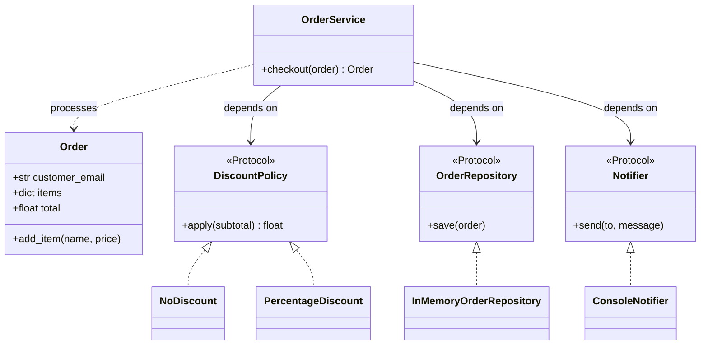

# solid-good-vs-bad-usage

A small Python demo showing that **well-designed classes are not enough**.
The classes in `domain.py` follow SOLID, but the code that *uses* them can still
be fragile if it ignores good design patterns and data-flow practices.

## Project structure

```
src/solid_demo/
├── domain.py       # SOLID classes: Order, OrderService, discount policies, Protocols
├── infra.py        # Concrete implementations: in-memory repository, console notifier
├── bad_usage.py    # Same classes, used with anti-patterns
└── good_usage.py   # Same classes, used with good patterns
```

## SOLID in `domain.py`

- **SRP:** `OrderService` only orchestrates checkout; storage and notification live elsewhere.
- **OCP:** add a new discount by writing a new `DiscountPolicy`; `OrderService` stays untouched.
- **LSP:** `NoDiscount` and `PercentageDiscount` are fully interchangeable.
- **ISP:** `DiscountPolicy`, `OrderRepository` and `Notifier` are tiny Protocols.
- **DIP:** `OrderService` depends on those Protocols, injected via its constructor.

## Bad vs. good usage

| `bad_usage.py` | `good_usage.py` |
|---|---|
| Global mutable `repo` | Dependencies injected, no globals |
| `if/elif` on strings to pick a policy | `Enum` + registry (`DISCOUNTS`) |
| Wiring rebuilt inside business logic | Single composition root (`build_app()`) |
| Client mutates `order.items` directly | `Order.add_item()` protects invariants |
| Raw strings/dicts as input | Frozen `CheckoutRequest` DTO validated at the boundary |
| `isinstance` on concrete types | Client never inspects concrete types |
| Typo `"vpi"` silently charges full price | Typo `"vpi"` is rejected with a clear error |

## Requirements

- Python 3.13+
- [uv](https://docs.astral.sh/uv/)

## Class diagram



## Run

From the project root:

```bash
# Good usage
uv run solid-demo-good

# Bad usage
uv run solid-demo-bad

# Compare side by side
uv run solid-demo-bad && echo "-----" && uv run solid-demo-good
```

You can also run the modules directly:

```bash
uv run python -m solid_demo.good_usage
uv run python -m solid_demo.bad_usage
```

## Example output

Good usage (`uv run solid-demo-good`):

```console
$ uv run solid-demo-good
[email -> ana@x.com] Order confirmed: $120.00
[email -> luis@x.com] Order confirmed: $210.00
[rejected] Unknown customer type: 'vpi'
[rejected] Invalid price for 'cable': -5.0
Saved orders: 2
```

Bad usage (`uv run solid-demo-bad`):

```console
$ uv run solid-demo-bad
[email -> ana@x.com] Order confirmed: $120.00
   (discount applied, saved: 1 )
[email -> luis@x.com] Order confirmed: $210.00
   (discount applied, saved: 2 )
[email -> eva@x.com] Order confirmed: $10.00
[email -> typo@x.com] Order confirmed: $10.00
```

Note how the bad version silently accepts the `"vpi"` typo and charges the full
price, while the good version rejects it (and the negative price) with a clear error.
